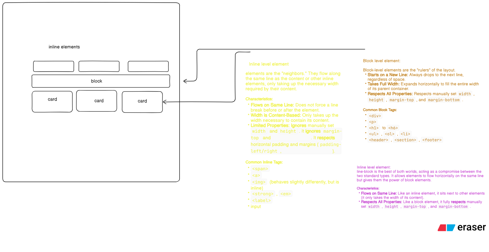

## 3 Type to add css in HTML

1. by inline : `
this is paragraph
`
2. by internal using ****:
   ``
3. by external stylesheet :
   make proper css file and write all css and link to html with `<link rel="stylesheet" href="./style.css />`

## CSS (Cascading Style Sheet):

- the meaning of **cascading** is to override the existing the default or applied css provided by browser.
- in general the property which comes after all the above css get their hand on style of the element
- There are also 3 major effects / reasons to apply css
- cascading
- specificity
- inheritance

2. specificity:

- the more specific the tag selected the more obvious it get the style
- tag
- class
- id
- inline
- !important
- specificity follows like this: tag < class < id < inline < !important

-Inheritance : basically the parent style inherits by child . font style , typography related styles mainly inherits. like

- color
- font-size
- font-weight

# Resources

## Display Property

